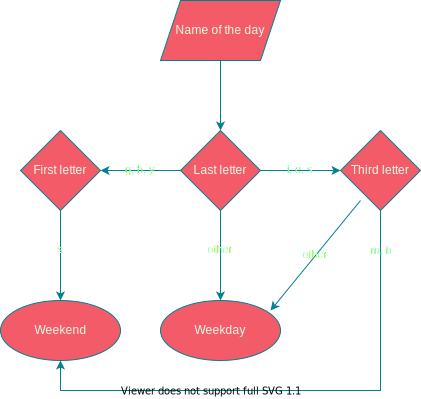

# is-it-a-weekday
Meme-module for "efficiently" checking whether a given day name is a weekday/weekend, with multi-language support.

## How does it determine the answer?

 - If it ends in 'g', 'h', or 'y' it is English or German
   - It is a weekday if the first letter is not 's'
 - If it ends in 'i', 'e' or 's' it is Spanish or French, or a Portuguese Weekend
   - It is a weekday if the third letter is not 'm' pr 'b'
 - Otherwise, it assumes it is a weekday because `statistics`

## What languages does it support?
 - English
 - Spanish
 - German
 - French
 - Portuguese
 - Other languages may or may not work. (Most likely they won't)

## Usage

### Python:
`weekday()` Receives a string containing only the name of the day. Returns True if it is the name of a weekday, False if it is the name of a weekend, and an True or False if it is not a supported language or not the name of a day. 

`weekend()` Shortcut for `not weekday`

### Ruby:
The module `IsItAWeekday` implements two methods:

`weekday?()` Receives a string containing only the name of the day. Returns true if it is the name of a weekday, false if it is the name of a weekend, and an true or false if it is not a supported language or not the name of a day.

`weekend?()` Shortcut for `not weekday`

## Want to add support for more languages?

Feel free to make a pull request adding the support. Just make sure:
 - All logic is contained in the `weekday()` function.
 - Only letter comparisons are used (No dictionaries with name - boolean pairs or anything like that)
 - Add the names in that language to the testing part of the main section.

## WHY?

I realized all days in english end in y, and all week-days in spanish end in s. What a neat coincidence am I right?
